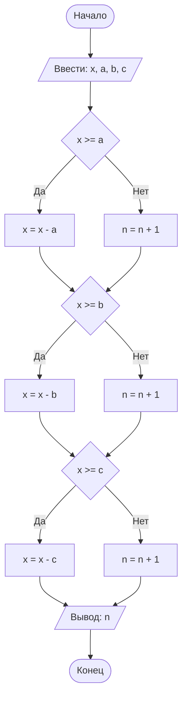

## Отчет по лабораторной работе № 1

#### № группы: `ПМ-2502`

#### Выполнила: `Дмитриева Мария Владимировна`

#### Вариант: `4`

### Cодержание:
- [Постановка задачи](#1-постановка-задачи)
- [Входные и выходные данные](#2-входные-и-выходные-данные)
- [Выбор структуры данных](#3-выбор-структуры-данных)
- [Алгоритм](#4-алгоритм)
- [Программа](#5-программа)
- [Анализ правильности решения](#6-анализ-правильности-решения)

### 1. Постановка задачи

> Трое жильцов решили выбросить в контейнер объемом X литров мусорные
> пакеты объемом A, B, C литров соответственно. Они подходят к контейнеру в указанном порядке и пытаются поместить
> пакет в контейнер. Если
> пакет не помещается в контейнер, жилец уносит свой пакет в другое место.
> Скольким жильцам не удастся выкинуть мусор в указанный контейнер? На
> вход программы подаются натуральные числа X, A, B, C.

Так как жильцы выбрасывают в контейнер мусорные пакеты в определенном порядке, то мы будем рассматривать каждый пакет в отдельности и сравнивать его объем с объемом контейнера. После сравнения переходим к следующему жильцу, уменьшая оставшийся объем контейнера, если пакет поместился. В результате необходимо вывести количество жильцов, которым не удастся выкинуть мусорный пакет.

### 2. Входные и выходные данные

#### Данные на вход

На вход программа должна получать 4 натуральных числа. Верхняя граница получаемых чисел не дана в условии задачи, поэтому будем считать верхней границей чисел 10<sup>3</sup>.

|                                 | Тип               | min значение  | max значение   |
|---------------------------------|-------------------|---------------|----------------|
| X (Объём контейнера)            | Натуральное число |       1       | 10<sup>3</sup> |
| A (Объём 1-го мусорного пакета) | Натуральное число |       1       | 10<sup>3</sup> |
| B (Объём 2-го мусорного пакета) | Натуральное число |       1       | 10<sup>3</sup> |
| C (Объём 3-го мусорного пакета) | Натуральное число |       1       | 10<sup>3</sup> |

#### Данные на выход

Т.к. программа должна вывести количество жильцов, которым не удастся выкинуть мусорный пакет в контейнер, то на выход мы получим целое неотрицательное число, не превышающее 3.

|                                                                       | Тип                                | min значение | max значение   |
|-----------------------------------------------------------------------|------------------------------------|--------------|----------------|  
| Число жильцов, которым не удастся выкинуть мусорный пакет в контейнер | Целое неотрицательное число        |      0       |       3        |
                                                                           
### 3. Выбор структуры данных

Программа получает 4 натуральных числа, не превышающих 10<sup>3</sup> < 2<sup>15</sup> (так как задача не предполагает больших объемов пакетов и контейнера). Поэтому для их хранения
можно выделить 4 переменных (`a`, `b`, `c` и `x`). Для переменных `a`, `b` и `c` используем тип `short`, а для переменной `x` используем тип `int`, так как эта переменная изменяется в ходе программы.

|                                 | название переменной | Тип (в Java) | 
|---------------------------------|---------------------|--------------|
| A (Объем 1-го мусорного пакета) | `a`                 | `short`      |
| B (Объем 2-го мусорного пакета) | `b`                 | `short`      | 
| C (Объем 3-го мусорного пакета) | `c`                 | `short`      |
| X (Объем контейнера)            | `x`                 | `int`        |

Для хранения и вывода результата необходима отдельная переменная, в которой будет сохранятся количество жильцов, которым не удастся выбросить мусорный пакет в контейнер. Число не превышает 3 < 128. Поэтому выделим 1 переменную (`n`) типа `byte`.

|                                                                       | название переменной | Тип (в Java) | 
|-----------------------------------------------------------------------|---------------------|--------------|
| Число жильцов, которым не удастся выкинуть мусорный пакет в контейнер | `n`                 | `byte`       |

### 4. Алгоритм

#### Алгоритм выполнения программы:

1. **Ввод данных:**  
   Программа считывает 3 натуральных числа, являющиеся объемами мусорных пакетов, обозначенные как `a` и `b` и `c`. Затем программа считывает натуральное число, являющееся объемом контейнера, обозначеное `x`. Вводится переменная `n` для счета пакетов, которые не поместятся в контейнер.

2. **Сравнение чисел:**  
   Программа сравнивает значения `x` и `a`. Если `x` больше или равно `a`, программа уменьшает `x` на `a` и переходит к следующему сравнению значений `x` и `b`. Если `a` больше, чем `x`, программа увеличивает переменную `n` на 1.
   Затем, по такому же принципу программа сравнивает переменные `x` и `b`, а затем `x` и `c`, уменьшая переменную `x`, если пакет помещается в контейнер, или увеличивая переменную `n`, если пакет не поместился.

3. **Вывод результата:**  
   На экран выводится переменная `n`, куда сохранилось количество жильцов, которым не удалось выбросить пакет в данный контейнер.

#### Блок-схема



### 5. Программа

```java
import java.io.PrintStream;
import java.util.Scanner;

public class Main {
    // Объявляем объект класса Scanner для ввода данных
    public static Scanner in = new Scanner(System.in);
    // Объявляем объект класса PrintStream для вывода данных
    public static PrintStream out = System.out;

    public static void main(String[] args) {
        // Считывание четырёх натуральных чисел a, b, c и x из консоли
        out.println("Введите объем пакета 1-го жильца:");
        short a = in.nextShort();
        out.println("Введите объем пакета 2-го жильца:");
        short b = in.nextShort();
        out.println("Введите объем пакета 3-го жильца:");
        short c = in.nextShort();
        out.println("Введите объем контейнера:");
        int x = in.nextInt();
        // Создадим переменную n для хранения результата
        byte n = 0;
        // Определим, поместится ли 1-й пакет в контейнер
        if (x >= a) {
            // Если a меньше или равно, чем x, то уменьшаем x на a
            // Иначе увеличиваем n на 1 и переходим к следующему пакету
            x = x - a;
        }
        else {
            n++;
        }
        if (x>=b) {
            // Если b меньше или равно, чем x, то уменьшаем x на b
            // Иначе увеличиваем n на 1 и переходим к следующему пакету
            x= x - b;
        }
        else {
            n++;
        }
        if (x>=c) {
            // Если c меньше или равно, чем x, то уменьшаем x на c
            // Иначе увеличиваем n на 1
            x= x - c;
        }
        else {
            n++;
        }
        // Выводим количество жильцов, которым не удастся выкинуть пакет в конейнер
        out.println("В контейнер не поместится" + " " + n + " " + "шт.");
    }
}
```
### 6. Анализ правильности решения

Программа работает корректно на всем множестве решений с учетом ограничений.

1. Тест на то, что пакет `a` не поместится в контейнер `x`,  а пакеты `b` и `c` поместятся:

    - **Input**:
        ```
        22
        10
        5
        20
        ```

    - **Output**:
        ```
        1
        ```
2. Тест на то, что пакет `b` не поместится в контейнер `x`,  а пакеты `a` и `c` поместятся:

    - **Input**:
        ```
        10
        22
        5
        20
        ```

    - **Output**:
        ```
        1
        ```
3. Тест на то, что пакет `c` не поместится в контейнер `x`,  а пакеты `a` и `b` поместятся:

    - **Input**:
        ```
        10
        5
        22
        20
        ```

    - **Output**:
        ```
        1
        ```
4. Тест на то, что в контейнер поместится только пакет `a`:

    - **Input**:
        ```
        19
        10
        5
        20
        ```

    - **Output**:
        ```
        2
        ```
5. Тест на то, что в контейнер поместится только пакет `b`:

    - **Input**:
        ```
        22
        19
        5
        20
        ```

    - **Output**:
        ```
        2
        ```
6. Тест на то, что в контейнер поместится только пакет `c`:

    - **Input**:
        ```
        22
        22
        5
        20
        ```

    - **Output**:
        ```
        2
        ```
7. Тест на то, что в контейнер поместятся все пакеты:

    - **Input**:
        ```
        10
        5
        5
        20
        ```

    - **Output**:
        ```
        0
        ```
8. Тест на то, что в контейнер не поместится ни один пакет:

    - **Input**:
        ```
        22
        22
        22
        20
        ```

    - **Output**:
        ```
        3
        ```
